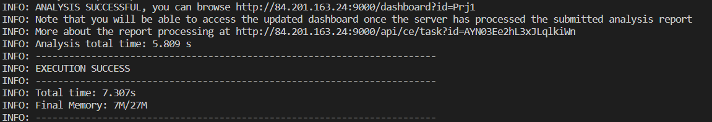

# Домашнее задание к занятию "09.03 CI\CD"

## Подготовка к выполнению

1. Создаём 2 VM в yandex cloud со следующими параметрами: 2CPU 4RAM Centos7(остальное по минимальным требованиям)
2. Прописываем в [inventory](./infrastructure/inventory/cicd/hosts.yml) [playbook'a](./infrastructure/site.yml) созданные хосты
3. Добавляем в [files](./infrastructure/files/) файл со своим публичным ключом (id_rsa.pub). Если ключ называется иначе - найдите таску в плейбуке, которая использует id_rsa.pub имя и исправьте на своё
4. Запускаем playbook, ожидаем успешного завершения
5. Проверяем готовность Sonarqube через [браузер](http://localhost:9000)
6. Заходим под admin\admin, меняем пароль на свой
7.  Проверяем готовность Nexus через [бразуер](http://localhost:8081)
8. Подключаемся под admin\admin123, меняем пароль, сохраняем анонимный доступ

## Знакомоство с SonarQube

### Основная часть

1. Создаём новый проект, название произвольное
2. Скачиваем пакет sonar-scanner, который нам предлагает скачать сам sonarqube
```
PATH=$PATH:~/sonar-scanner/bin
```
3. Делаем так, чтобы binary был доступен через вызов в shell (или меняем переменную PATH или любой другой удобный вам способ)
4. Проверяем `sonar-scanner --version`
```
chmod -R 775 sonar-scanner/
[locadm@vm2 ~]$ sonar-scanner --version
INFO: Scanner configuration file: /home/locadm/sonar-scanner/conf/sonar-scanner.properties
INFO: Project root configuration file: NONE
INFO: SonarScanner 4.7.0.2747
INFO: Java 11.0.14.1 Eclipse Adoptium (64-bit)
INFO: Linux 3.10.0-1160.66.1.el7.x86_64 amd64
```
проверка 
```
[locadm@vm2 ~]$ sonar-scanner \
>   -Dsonar.projectKey=Prj1 \
>   -Dsonar.sources=. \
>   -Dsonar.host.url=http://84.201.163.24:9000 \
>   -Dsonar.login=7f08a25cb8b40e6ea89c6f07da150bbf79c96dc2
INFO: Scanner configuration file: /home/locadm/sonar-scanner/conf/sonar-scanner.properties
INFO: Project root configuration file: NONE
INFO: SonarScanner 4.7.0.2747
INFO: Java 11.0.14.1 Eclipse Adoptium (64-bit)
INFO: Linux 3.10.0-1160.66.1.el7.x86_64 amd64
INFO: User cache: /home/locadm/.sonar/cache
INFO: Scanner configuration file: /home/locadm/sonar-scanner/conf/sonar-scanner.properties
INFO: Project root configuration file: NONE
INFO: Analyzing on SonarQube server 9.1.0
INFO: Default locale: "en_US", source code encoding: "UTF-8" (analysis is platform dependent)
INFO: Load global settings
INFO: Load global settings (done) | time=119ms
INFO: Server id: 9CFC3560-AYNclOLa-XxervH8iUa4
INFO: User cache: /home/locadm/.sonar/cache
INFO: Load/download plugins
INFO: Load plugins index
INFO: Load plugins index (done) | time=141ms
INFO: Load/download plugins (done) | time=2037ms
INFO: Process project properties
INFO: Process project properties (done) | time=12ms
INFO: Execute project builders
INFO: Execute project builders (done) | time=2ms
INFO: Project key: Prj1
INFO: Base dir: /home/locadm
INFO: Working dir: /home/locadm/.scannerwork
INFO: Load project settings for component key: 'Prj1'
INFO: Load project settings for component key: 'Prj1' (done) | time=73ms
INFO: Load quality profiles
INFO: Load quality profiles (done) | time=488ms
INFO: Load active rules
INFO: Load active rules (done) | time=3357ms
WARN: SCM provider autodetection failed. Please use "sonar.scm.provider" to define SCM of your project, or disable the SCM Sensor in the project settings.
INFO: Indexing files...
INFO: Project configuration:
INFO: 266 files indexed
INFO: ------------- Run sensors on module Prj1
INFO: Load metrics repository
INFO: Load metrics repository (done) | time=86ms
INFO: Sensor CSS Rules [cssfamily]
INFO: No CSS, PHP, HTML or VueJS files are found in the project. CSS analysis is skipped.
INFO: Sensor CSS Rules [cssfamily] (done) | time=2ms
INFO: Sensor JaCoCo XML Report Importer [jacoco]
INFO: 'sonar.coverage.jacoco.xmlReportPaths' is not defined. Using default locations: target/site/jacoco/jacoco.xml,target/site/jacoco-it/jacoco.xml,build/reports/jacoco/test/jacocoTestReport.xml
INFO: No report imported, no coverage information will be imported by JaCoCo XML Report Importer
INFO: Sensor JaCoCo XML Report Importer [jacoco] (done) | time=9ms
INFO: Sensor C# Project Type Information [csharp]
INFO: Sensor C# Project Type Information [csharp] (done) | time=2ms
INFO: Sensor C# Analysis Log [csharp]
INFO: Sensor C# Analysis Log [csharp] (done) | time=22ms
INFO: Sensor C# Properties [csharp]
INFO: Sensor C# Properties [csharp] (done) | time=0ms
INFO: Sensor JavaXmlSensor [java]
INFO: Sensor JavaXmlSensor [java] (done) | time=4ms
INFO: Sensor HTML [web]
INFO: Sensor HTML [web] (done) | time=4ms
INFO: Sensor VB.NET Project Type Information [vbnet]
INFO: Sensor VB.NET Project Type Information [vbnet] (done) | time=9ms
INFO: Sensor VB.NET Analysis Log [vbnet]
INFO: Sensor VB.NET Analysis Log [vbnet] (done) | time=19ms
INFO: Sensor VB.NET Properties [vbnet]
INFO: Sensor VB.NET Properties [vbnet] (done) | time=0ms
INFO: ------------- Run sensors on project
INFO: Sensor Zero Coverage Sensor
INFO: Sensor Zero Coverage Sensor (done) | time=3ms
INFO: SCM Publisher No SCM system was detected. You can use the 'sonar.scm.provider' property to explicitly specify it.
INFO: CPD Executor Calculating CPD for 0 files
INFO: CPD Executor CPD calculation finished (done) | time=0ms
INFO: Analysis report generated in 91ms, dir size=101.5 kB
INFO: Analysis report compressed in 14ms, zip size=12.4 kB
INFO: Analysis report uploaded in 85ms
INFO: ANALYSIS SUCCESSFUL, you can browse http://84.201.163.24:9000/dashboard?id=Prj1
INFO: Note that you will be able to access the updated dashboard once the server has processed the submitted analysis report
INFO: More about the report processing at http://84.201.163.24:9000/api/ce/task?id=AYN0xvKKhL3xJLqlkiWj
INFO: Analysis total time: 6.933 s
INFO: ------------------------------------------------------------------------
INFO: EXECUTION SUCCESS
INFO: ------------------------------------------------------------------------
INFO: Total time: 10.733s
INFO: Final Memory: 7M/24M
INFO: ------------------------------------------------------------------------
```
5. Запускаем анализатор против кода из директории [example](./example) с дополнительным ключом `-Dsonar.coverage.exclusions=fail.py`
```
sonar-scanner \
    -Dsonar.projectKey=Prj1 \
    -Dsonar.sources=. \
    -Dsonar.host.url=http://84.201.163.24:9000 \
    -Dsonar.login=7f08a25cb8b40e6ea89c6f07da150bbf79c96dc2\
    -Dsonar.coverage.exclusions=fail.py
```
6. Смотрим результат в интерфейсе
```
[locadm@vm2 example]$ sonar-scanner \
>     -Dsonar.projectKey=Prj1 \
>     -Dsonar.sources=. \
>     -Dsonar.host.url=http://84.201.163.24:9000 \
>     -Dsonar.login=7f08a25cb8b40e6ea89c6f07da150bbf79c96dc2\
>     -Dsonar.coverage.exclusions=fail.py
INFO: Scanner configuration file: /home/locadm/sonar-scanner/conf/sonar-scanner.properties
INFO: Project root configuration file: NONE
INFO: SonarScanner 4.7.0.2747
INFO: Java 11.0.14.1 Eclipse Adoptium (64-bit)
INFO: Linux 3.10.0-1160.66.1.el7.x86_64 amd64
INFO: User cache: /home/locadm/.sonar/cache
INFO: Scanner configuration file: /home/locadm/sonar-scanner/conf/sonar-scanner.properties
INFO: Project root configuration file: NONE
INFO: Analyzing on SonarQube server 9.1.0
INFO: Default locale: "en_US", source code encoding: "UTF-8" (analysis is platform dependent)
INFO: Load global settings
INFO: Load global settings (done) | time=102ms
INFO: Server id: 9CFC3560-AYNclOLa-XxervH8iUa4
INFO: User cache: /home/locadm/.sonar/cache
INFO: Load/download plugins
INFO: Load plugins index
INFO: Load plugins index (done) | time=54ms
INFO: Load/download plugins (done) | time=164ms
INFO: Process project properties
INFO: Process project properties (done) | time=14ms
INFO: Execute project builders
INFO: Execute project builders (done) | time=2ms
INFO: Project key: Prj1
INFO: Base dir: /home/locadm/example
INFO: Working dir: /home/locadm/example/.scannerwork
INFO: Load project settings for component key: 'Prj1'
INFO: Load project settings for component key: 'Prj1' (done) | time=46ms
INFO: Load quality profiles
INFO: Load quality profiles (done) | time=172ms
INFO: Load active rules
INFO: Load active rules (done) | time=1983ms
WARN: SCM provider autodetection failed. Please use "sonar.scm.provider" to define SCM of your project, or disable the SCM Sensor in the project settings.
INFO: Indexing files...
INFO: Project configuration:
INFO:   Excluded sources for coverage: fail.py
INFO: 1 file indexed
INFO: Quality profile for py: Sonar way
INFO: ------------- Run sensors on module Prj1
INFO: Load metrics repository
INFO: Load metrics repository (done) | time=53ms
INFO: Sensor Python Sensor [python]
WARN: Your code is analyzed as compatible with python 2 and 3 by default. This will prevent the detection of issues specific to python 2 or python 3. You can get a more precise analysis by setting a python version in your configuration via the parameter "sonar.python.version"
INFO: Starting global symbols computation
INFO: Load project repositories
INFO: 1 source file to be analyzed
INFO: Load project repositories (done) | time=27ms
INFO: 1/1 source file has been analyzed
INFO: Starting rules execution
INFO: 1 source file to be analyzed
INFO: 1/1 source file has been analyzed
INFO: Sensor Python Sensor [python] (done) | time=1041ms
INFO: Sensor Cobertura Sensor for Python coverage [python]
INFO: Sensor Cobertura Sensor for Python coverage [python] (done) | time=13ms
INFO: Sensor PythonXUnitSensor [python]
INFO: Sensor PythonXUnitSensor [python] (done) | time=1ms
INFO: Sensor CSS Rules [cssfamily]
INFO: No CSS, PHP, HTML or VueJS files are found in the project. CSS analysis is skipped.
INFO: Sensor CSS Rules [cssfamily] (done) | time=1ms
INFO: Sensor JaCoCo XML Report Importer [jacoco]
INFO: 'sonar.coverage.jacoco.xmlReportPaths' is not defined. Using default locations: target/site/jacoco/jacoco.xml,target/site/jacoco-it/jacoco.xml,build/reports/jacoco/test/jacocoTestReport.xml
INFO: No report imported, no coverage information will be imported by JaCoCo XML Report Importer
INFO: Sensor JaCoCo XML Report Importer [jacoco] (done) | time=3ms
INFO: Sensor C# Project Type Information [csharp]
INFO: Sensor C# Project Type Information [csharp] (done) | time=1ms
INFO: Sensor C# Analysis Log [csharp]
INFO: Sensor C# Analysis Log [csharp] (done) | time=17ms
INFO: Sensor C# Properties [csharp]
INFO: Sensor C# Properties [csharp] (done) | time=0ms
INFO: Sensor JavaXmlSensor [java]
INFO: Sensor JavaXmlSensor [java] (done) | time=1ms
INFO: Sensor HTML [web]
INFO: Sensor HTML [web] (done) | time=3ms
INFO: Sensor VB.NET Project Type Information [vbnet]
INFO: Sensor VB.NET Project Type Information [vbnet] (done) | time=1ms
INFO: Sensor VB.NET Analysis Log [vbnet]
INFO: Sensor VB.NET Analysis Log [vbnet] (done) | time=17ms
INFO: Sensor VB.NET Properties [vbnet]
INFO: Sensor VB.NET Properties [vbnet] (done) | time=0ms
INFO: ------------- Run sensors on project
INFO: Sensor Zero Coverage Sensor
INFO: Sensor Zero Coverage Sensor (done) | time=0ms
INFO: SCM Publisher No SCM system was detected. You can use the 'sonar.scm.provider' property to explicitly specify it.
INFO: CPD Executor Calculating CPD for 1 file
INFO: CPD Executor CPD calculation finished (done) | time=12ms
INFO: Analysis report generated in 137ms, dir size=102.9 kB
INFO: Analysis report compressed in 20ms, zip size=14.1 kB
INFO: Analysis report uploaded in 23ms
INFO: ANALYSIS SUCCESSFUL, you can browse http://84.201.163.24:9000/dashboard?id=Prj1
INFO: Note that you will be able to access the updated dashboard once the server has processed the submitted analysis report
INFO: More about the report processing at http://84.201.163.24:9000/api/ce/task?id=AYN00-bXhL3xJLqlkiWl
INFO: Analysis total time: 6.350 s
INFO: ------------------------------------------------------------------------
INFO: EXECUTION SUCCESS
INFO: ------------------------------------------------------------------------
INFO: Total time: 7.793s
INFO: Final Memory: 7M/27M
INFO: ------------------------------------------------------------------------
```
7. Исправляем ошибки, которые он выявил(включая warnings)
```
WARN: Your code is analyzed as compatible with python 2 and 3 by default. This will prevent the detection of issues specific to python 2 or python 3. You can get a more precise analysis by setting a python version in your configuration via the parameter "sonar.python.version"
```
Добавляем в sonar-scanner.properties
```
sonar.python.version=3.7
```
8. Запускаем анализатор повторно - проверяем, что QG пройдены успешно
```
[locadm@vm2 example]$ sonar-scanner \
>     -Dsonar.projectKey=Prj1 \
>     -Dsonar.sources=. \
>     -Dsonar.host.url=http://84.201.163.24:9000 \
>     -Dsonar.login=7f08a25cb8b40e6ea89c6f07da150bbf79c96dc2\
>     -Dsonar.coverage.exclusions=fail.py
INFO: Scanner configuration file: /home/locadm/sonar-scanner/conf/sonar-scanner.properties
INFO: Project root configuration file: NONE
INFO: SonarScanner 4.7.0.2747
INFO: Java 11.0.14.1 Eclipse Adoptium (64-bit)
INFO: Linux 3.10.0-1160.66.1.el7.x86_64 amd64
INFO: User cache: /home/locadm/.sonar/cache
INFO: Scanner configuration file: /home/locadm/sonar-scanner/conf/sonar-scanner.properties
INFO: Project root configuration file: NONE
INFO: Analyzing on SonarQube server 9.1.0
INFO: Default locale: "en_US", source code encoding: "UTF-8" (analysis is platform dependent)
INFO: Load global settings
INFO: Load global settings (done) | time=114ms
INFO: Server id: 9CFC3560-AYNclOLa-XxervH8iUa4
INFO: User cache: /home/locadm/.sonar/cache
INFO: Load/download plugins
INFO: Load plugins index
INFO: Load plugins index (done) | time=60ms
INFO: Load/download plugins (done) | time=177ms
INFO: Process project properties
INFO: Process project properties (done) | time=11ms
INFO: Execute project builders
INFO: Execute project builders (done) | time=1ms
INFO: Project key: Prj1
INFO: Base dir: /home/locadm/example
INFO: Working dir: /home/locadm/example/.scannerwork
INFO: Load project settings for component key: 'Prj1'
INFO: Load project settings for component key: 'Prj1' (done) | time=25ms
INFO: Load quality profiles
INFO: Load quality profiles (done) | time=114ms
INFO: Load active rules
INFO: Load active rules (done) | time=1642ms
WARN: SCM provider autodetection failed. Please use "sonar.scm.provider" to define SCM of your project, or disable the SCM Sensor in the project settings.
INFO: Indexing files...
INFO: Project configuration:
INFO:   Excluded sources for coverage: fail.py
INFO: 1 file indexed
INFO: Quality profile for py: Sonar way
INFO: ------------- Run sensors on module Prj1
INFO: Load metrics repository
INFO: Load metrics repository (done) | time=55ms
INFO: Sensor Python Sensor [python]
INFO: Starting global symbols computation
INFO: 1 source file to be analyzed
INFO: Load project repositories
INFO: Load project repositories (done) | time=20ms
INFO: 1/1 source file has been analyzed
INFO: Starting rules execution
INFO: 1 source file to be analyzed
INFO: 1/1 source file has been analyzed
INFO: Sensor Python Sensor [python] (done) | time=883ms
INFO: Sensor Cobertura Sensor for Python coverage [python]
INFO: Sensor Cobertura Sensor for Python coverage [python] (done) | time=12ms
INFO: Sensor PythonXUnitSensor [python]
INFO: Sensor PythonXUnitSensor [python] (done) | time=1ms
INFO: Sensor CSS Rules [cssfamily]
INFO: No CSS, PHP, HTML or VueJS files are found in the project. CSS analysis is skipped.
INFO: Sensor CSS Rules [cssfamily] (done) | time=1ms
INFO: Sensor JaCoCo XML Report Importer [jacoco]
INFO: 'sonar.coverage.jacoco.xmlReportPaths' is not defined. Using default locations: target/site/jacoco/jacoco.xml,target/site/jacoco-it/jacoco.xml,build/reports/jacoco/test/jacocoTestReport.xml
INFO: No report imported, no coverage information will be imported by JaCoCo XML Report Importer
INFO: Sensor JaCoCo XML Report Importer [jacoco] (done) | time=2ms
INFO: Sensor C# Project Type Information [csharp]
INFO: Sensor C# Project Type Information [csharp] (done) | time=0ms
INFO: Sensor C# Analysis Log [csharp]
INFO: Sensor C# Analysis Log [csharp] (done) | time=19ms
INFO: Sensor C# Properties [csharp]
INFO: Sensor C# Properties [csharp] (done) | time=0ms
INFO: Sensor JavaXmlSensor [java]
INFO: Sensor JavaXmlSensor [java] (done) | time=1ms
INFO: Sensor HTML [web]
INFO: Sensor HTML [web] (done) | time=3ms
INFO: Sensor VB.NET Project Type Information [vbnet]
INFO: Sensor VB.NET Project Type Information [vbnet] (done) | time=3ms
INFO: Sensor VB.NET Analysis Log [vbnet]
INFO: Sensor VB.NET Analysis Log [vbnet] (done) | time=18ms
INFO: Sensor VB.NET Properties [vbnet]
INFO: Sensor VB.NET Properties [vbnet] (done) | time=0ms
INFO: ------------- Run sensors on project
INFO: Sensor Zero Coverage Sensor
INFO: Sensor Zero Coverage Sensor (done) | time=1ms
INFO: SCM Publisher No SCM system was detected. You can use the 'sonar.scm.provider' property to explicitly specify it.
INFO: CPD Executor Calculating CPD for 1 file
INFO: CPD Executor CPD calculation finished (done) | time=11ms
INFO: Analysis report generated in 129ms, dir size=102.7 kB
INFO: Analysis report compressed in 27ms, zip size=13.9 kB
INFO: Analysis report uploaded in 40ms
INFO: ANALYSIS SUCCESSFUL, you can browse http://84.201.163.24:9000/dashboard?id=Prj1
INFO: Note that you will be able to access the updated dashboard once the server has processed the submitted analysis report
INFO: More about the report processing at http://84.201.163.24:9000/api/ce/task?id=AYN03Ee2hL3xJLqlkiWn
INFO: Analysis total time: 5.809 s
INFO: ------------------------------------------------------------------------
INFO: EXECUTION SUCCESS
INFO: ------------------------------------------------------------------------
INFO: Total time: 7.307s
INFO: Final Memory: 7M/27M
INFO: ------------------------------------------------------------------------
```
9. Делаем скриншот успешного прохождения анализа, прикладываем к решению ДЗ


## Знакомство с Nexus

### Основная часть
[Дока. Nexus](https://habr.com/ru/post/473358/)

1. В репозиторий `maven-public` загружаем артефакт с GAV параметрами:
   1. groupId: netology
   2. artifactId: java
   3. version: 8_282
   4. classifier: distrib
   5. type: tar.gz
2. В него же загружаем такой же артефакт, но с version: 8_102
3. Проверяем, что все файлы загрузились успешно
4. В ответе присылаем файл `maven-metadata.xml` для этого артефекта

### Знакомство с Maven

### Подготовка к выполнению

1. Скачиваем дистрибутив с [maven](https://maven.apache.org/download.cgi)
2. Разархивируем, делаем так, чтобы binary был доступен через вызов в shell (или меняем переменную PATH или любой другой удобный вам способ)
3. Удаляем из `apache-maven-<version>/conf/settings.xml` упоминание о правиле, отвергающем http соединение( раздел mirrors->id: my-repository-http-unblocker)
4. Проверяем `mvn --version`
5. Забираем директорию [mvn](./mvn) с pom

### Основная часть

1. Меняем в `pom.xml` блок с зависимостями под наш артефакт из первого пункта задания для Nexus (java с версией 8_282)
2. Запускаем команду `mvn package` в директории с `pom.xml`, ожидаем успешного окончания
3. Проверяем директорию `~/.m2/repository/`, находим наш артефакт
4. В ответе присылаем исправленный файл `pom.xml`

---

### Как оформить ДЗ?

Выполненное домашнее задание пришлите ссылкой на .md-файл в вашем репозитории.

---
