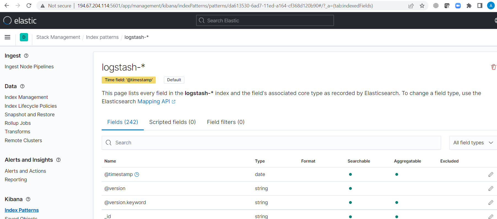

# Домашнее задание к занятию "10.04. ELK"

## Дополнительные ссылки

При выполнении задания пользуйтесь вспомогательными ресурсами:
```
Пора вам новый курс вводить по организации VPN сервера. 
Развернул openvpn на казахском сервере и прокинул интернет, для того, чтобы скачать образы. 
Они заблокированы для России(.
```

- [поднимаем elk в докер](https://www.elastic.co/guide/en/elastic-stack-get-started/current/get-started-docker.html)
- [поднимаем elk в докер с filebeat и докер логами](https://www.sarulabs.com/post/5/2019-08-12/sending-docker-logs-to-elasticsearch-and-kibana-with-filebeat.html)
- [конфигурируем logstash](https://www.elastic.co/guide/en/logstash/current/configuration.html)
- [плагины filter для logstash](https://www.elastic.co/guide/en/logstash/current/filter-plugins.html)
- [конфигурируем filebeat](https://www.elastic.co/guide/en/beats/libbeat/5.3/config-file-format.html)
- [привязываем индексы из elastic в kibana](https://www.elastic.co/guide/en/kibana/current/index-patterns.html)
- [как просматривать логи в kibana](https://www.elastic.co/guide/en/kibana/current/discover.html)
- [решение ошибки increase vm.max_map_count elasticsearch](https://stackoverflow.com/questions/42889241/how-to-increase-vm-max-map-count)

В процессе выполнения задания могут возникнуть также не указанные тут проблемы в зависимости от системы.
```
А дальше начались 'танцы с бубнами' при запуске композера.
```

Используйте output stdout filebeat/kibana и api elasticsearch для изучения корня проблемы и ее устранения.

## Задание повышенной сложности

Не используйте директорию [help](./help) при выполнении домашнего задания.

## Задание 1

Вам необходимо поднять в докере:
- elasticsearch(hot и warm ноды)
- logstash
- kibana
- filebeat

и связать их между собой.
```
Опять с non-root user нечего не работает...
Ошибка filebeat на non-root:

sudo chown root filebeat.yml 
sudo chmod go-w filebeat.yml 

Ошибки es-hot, es-warm
[1]: max virtual memory areas vm.max_map_count [65530] is too low, increase to at least [262144]
sudo sysctl -w vm.max_map_count=262144 
```

Logstash следует сконфигурировать для приёма по tcp json сообщений.
```
добавил в logtash.conf
...
filter {
  json {
    # AT 
    source => "message"
  }
}
```


Filebeat следует сконфигурировать для отправки логов docker вашей системы в logstash.

В директории [help](./help) находится манифест docker-compose и конфигурации filebeat/logstash для быстрого 
выполнения данного задания.

```
Открыв логи logstash все мелькает в глазах. Так не пойдет.
Потестируем отдельный фаил из old. 
    paths:
      # - '/var/lib/docker/containers/*/*.log'
      - '/var/lib/docker/containers/old/*.log'

Скопировал лог контейнера приложения и посмотрел logstash. Оооо! Не мелькает в глазах. Я остановил время!


Ок, видно что получает logstash
Перекидываем обратно на живые логи: 
 - /var/lib/docker/containers/*/*.log

Ждем биты (не tcp), которые только что настроил в logstash, последний поднимается медленно
  
  beats {
    port => 5046
    codec => json
  }

  # tcp {
  #   port => 5046
  #   codec => json
  # }

  В логах не видно 5046 порта, хм, правим docker-compose yml, как то так
      - ./configs/logstash.conf:/usr/share/logstash/pipeline/logstash.yml:Z
  
  так, увидел порт 5046

добавил методанные контейнера, хотя не требовалось
  в filebeat
  - add_docker_metadata: ~


Да сеть закинул в композер filebeat
 networks:
      - elastic

Открываю elastic Stack Monitor, ей а где Indices? Только системный 
Смотри Kibana - Healthy! 
```

```
Хосты баз видны, а данных нет!

Ждем, logstash не спешит. Не сразу стартует, ждет пока остальные микросервисы поднимуться.

```

Результатом выполнения данного задания должны быть:
- скриншот `docker ps` через 5 минут после старта всех контейнеров (их должно быть 5)
- скриншот интерфейса kibana
- docker-compose манифест (если вы не использовали директорию help)
- ваши yml конфигурации для стека (если вы не использовали директорию help)
```
А ну да, увлекся вернемся к контейнерам 
Так то по композеру 6 должно быть)
```

```
Так, логи пишутся
```


```
Манифесты правил, ниже прикрепил.
```
## Задание 2

Перейдите в меню [создания index-patterns  в kibana](http://localhost:5601/app/management/kibana/indexPatterns/create)
и создайте несколько index-patterns из имеющихся.

```
Добавил logstash
```

Перейдите в меню просмотра логов в kibana (Discover) и самостоятельно изучите как отображаются логи и как производить 
поиск по логам.

В манифесте директории help также приведенно dummy приложение, которое генерирует рандомные события в stdout контейнера.
Данные логи должны порождать индекс logstash-* в elasticsearch. Если данного индекса нет - воспользуйтесь советами 
и источниками из раздела "Дополнительные ссылки" данного ДЗ.
```
Ну и типа фильтруем контейнер, а logstash выцепляет message (по фильтру в yml конфиге)
Как то так:
```

---
ссылки:
[filebeat.yml](./help/configs/filebeat.yml)
[logstash.conf](./help/configs/logstash.conf)
[run.py](./help/pinger/run.py)
[docker-compose.yml](./help/docker-compose.yml)

```
Пора стопонуть, место на vds заканчивается )
```
### Как оформить ДЗ?

Выполненное домашнее задание пришлите ссылкой на .md-файл в вашем репозитории.

---

 
